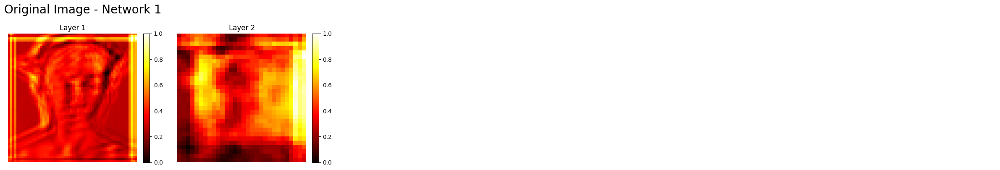
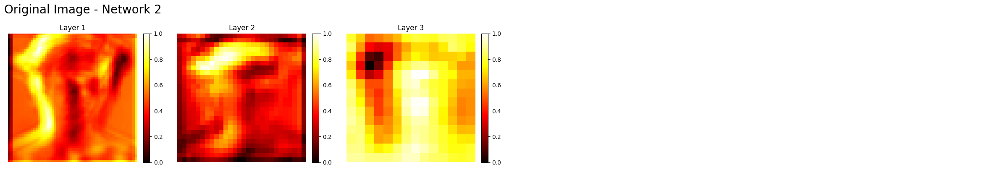
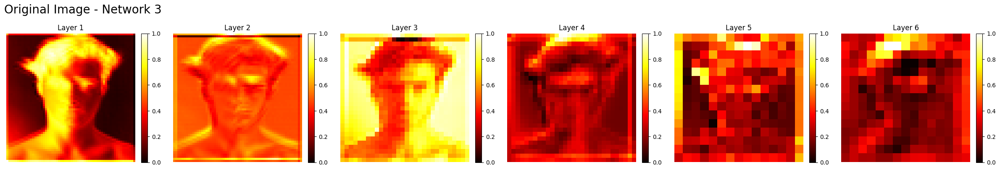
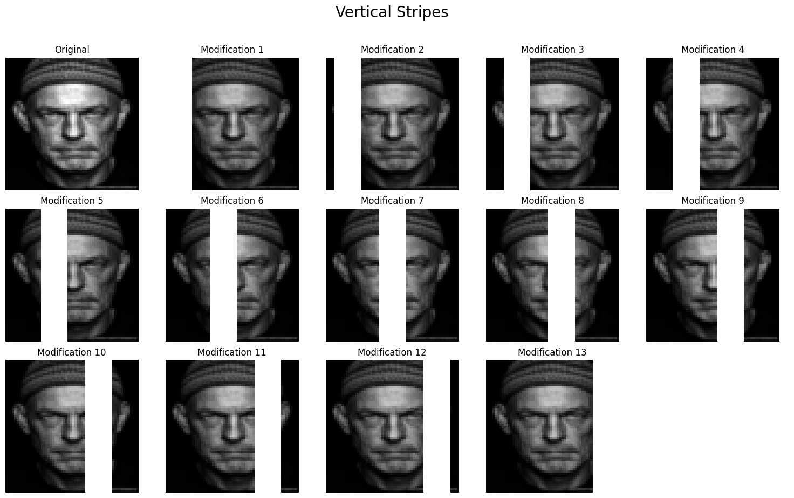
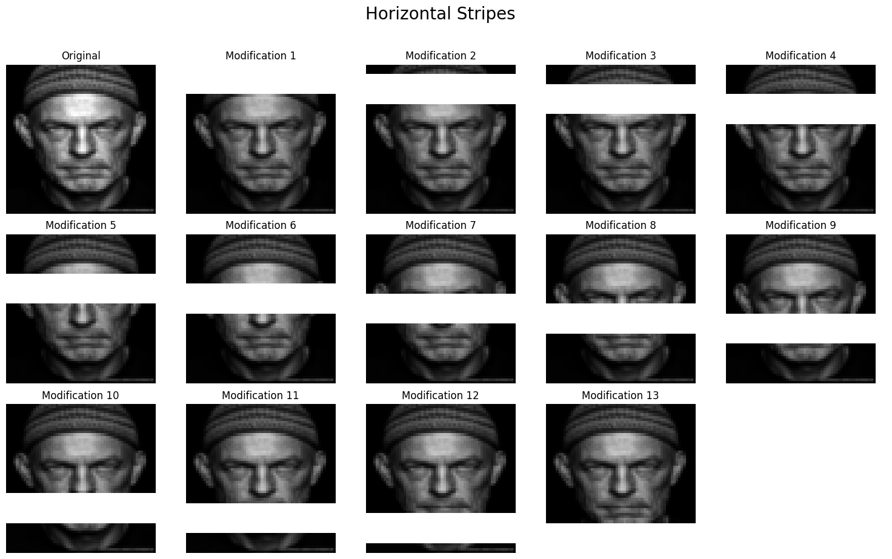
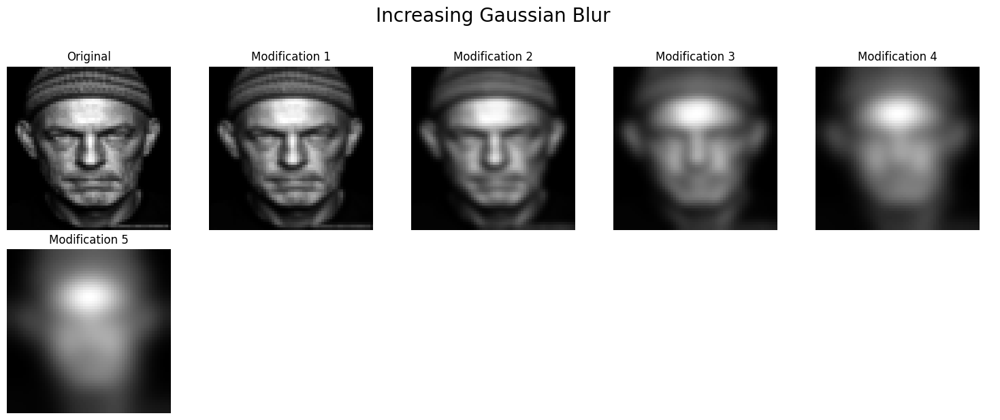
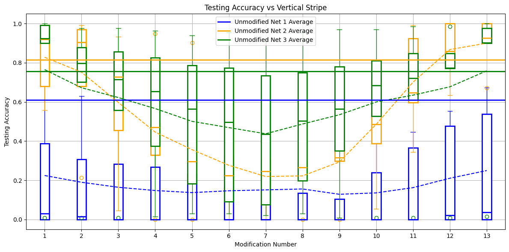

# Simulating IT Cortex Face Responsivity Through Deep Learning Models

This project investigates how convolutional neural networks (CNNs) can replicate the specialized visual recognition capabilities of the primate **inferior temporal (IT) cortex**. By testing models of varying complexity against intact and distorted facial stimuli, the study aims to bridge artificial architectures with biological vision mechanisms. This research is motivated by neurophysiological findings that IT neurons are highly face-selective and show significantly reduced firing rates when key features like the eyes or mouth are removed. This project implements three distinct models in TensorFlow to observe these neural parallels:

## Models
* **CNN1 (Shallow):** A baseline model with two convolution layers focused on low-level edge and texture detection.

* **CNN2 (Intermediate):** A multi-layer model targeting mid-level feature representations, utilizing more convolution layers, batch normalization, and dropout for stability.

* **CNN3 (Deep Residual):** A RNN architecture employing residual blocks to enable deeper learning without performance degradation.

## Activation Map Analysis

Activation maps visualize how internal filters respond to specific features, acting as a proxy for neural firing patterns.

**CNN1:** Displayed uninformative, diffuse activation with no clear spatial structure.

**CNN2:** Showed focused responses along facial outlines, indicating effective edge detection similar to early visual processing areas like CNN1.

**CNN3:** Produced well-structured maps that highlighted specific features with high precision, demonstrating a superior capacity for complex feature extraction.

## Data Preprocessing

Models were trained on a dataset containing human faces and non-facial objects such as bicycles, flowers, and horses. All images were converted to grayscale and resized to pixels to standardize input and reduce computational requirements,the training set 
was then evenly sampled to consist of **523 human images** and **536 non-face images**.

### Experimental Stimuli

To analyze feature sensitivity, facial images were subjected to several distortions:

**Horizontal Occlusion:** A 16-pixel-wide white stripe moved vertically across the face in 10-pixel steps for 13 total positions.

**Vertical Occlusion:** A similar 16-pixel-wide white stripe moved horizontally across the face.

**Gaussian Blur:** Five levels of increasing blur were applied to determine the models' reliance on fine-grained versus general shapes.

## Results

Performance was evaluated using classification accuracy and **5-fold cross-validation** to ensure statistical reliability. CNN1 failed to distinguish faces from non-faces, with accuracy hovering around **50%** throughout training while CNN2 achieved the highest 
testing accuracy, reaching the **high 80s**, and proved most robust to blurring. Both CNN2 and CNN3 showed a substantial drop in accuracy when the **eye region** (modifications 2–4) was occluded, aligning with sensitivities observed in biological IT neurons.

The study supports the hypothesis that hierarchical CNNs mirror biological vision mechanisms. While **CNN2** proved most biologically accurate in terms of generalizability and robustness to blur, the deeper **CNN3** showed high precision but was more prone to overfitting on fine details. These findings reinforce the critical importance of the eye and nose regions in both artificial and biological facial recognition.